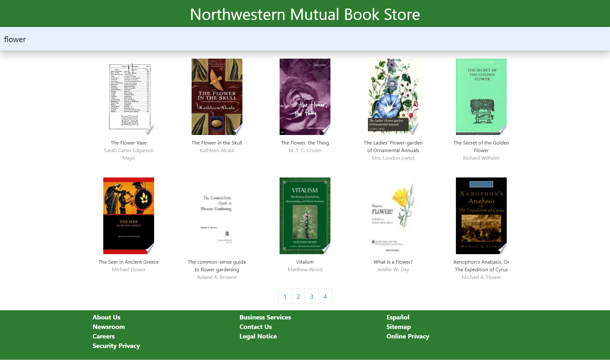

# BookHunt

This is a responsive web application to seach books by its title, It uses the [Google Books API](https://developers.google.com/books/) to retrieve books. The result from this application can be verified against the [Google Books](https://books.google.com/) website.

The Google API sorts books based on relavence and/or published date. As this challenge required to sort things alphabetically the books returned from the google api is persisted in the local database there by giving us the flexibility of sorting, improved performance by faster retrieval of local data, being able to customize, etc. These tables are truncated periodically to make sure the data is consistent with the actual API. To improve the performance even more Spring Caching has been implemented this cache is also cleared periodically.

## Overview
BookHunt App has two parts to it as mentioned below. This provides flexibility, reusability, better testable code, seperation of concern and can be independently enhanced modified or even replaced.

1. book-hunt-ui : This project builds the front-end of the app.
2. BookHuntService : This back-end project exposes the Rest API's needed to support the front-end.

Each of these projects contain specific README.md files please refem them for installation and set up.
NOTE : Make sure to have the back-end application up and running on http://localhost:8080 before starting front-end

# book-hunt-ui - The FrontEnd

book-hunt-ui project creates the UI for the App using React and Redux. This project was bootstrapped with [Create React App](https://github.com/facebook/create-react-app).

## Why React 
Create React App gets our React frontend application up and running in no time. It speeds up the initial phase by stitching together everything you need to get your React frontend working with minimal effort on your part, and it shortens your feedback loop by enabling hot reload. That way, you can just save your files, and changes will be immediately visible in the browser.

React’s simplicity lies in that it makes it easy to declare user-interfaces in self-contained independent components. It hides its complex rendering engine implementation and exposes a simple component API.

Key benefits include :
* Reusable Components
* One-Way Data Flow
* The Virtual DOM
* Great Developer Tools
* It’s Easier to Write with JSX

## Why Redux
Redux is a state management tool for JavaScript applications.The main concept behind Redux is that the entire state of an application is stored in one central location. Each component of an application can have direct access to the state of the application without having to send props down to child components or using callback functions to send data back up to a parent.

Key Benefits include:
* Predictable state updates make it easier to understand how the data flow works in the application
* The use of "pure" reducer functions makes logic easier to test, and enables useful features like "time-travel debugging".
* Centralizing the state makes it easier to implement things like logging changes to the data, or persisting data between page refreshes

# BookHuntService - The BackEnd

The Backend is a SpringBoot application, Developing Spring applications with Spring Boot is a real time saver. It gets you up and running quickly, and continues to make your life easier as you move to production and start releasing incremental updates to your application.

## Why SpringBoot
Springboot eases the Java-based applications Development, Unit Test and Integration Test Process and reduce Development, Unit Test and Integration Test time by providing some default configuration.

Key Benefits include:
* Auto configuration : It attempts to automatically configure your Spring application based on the jar dependencies that you have added in classpath. 
* In-memory H2 database : It make sit easy during development phase
* Embedded Server : like Tomcat, Jetty etc. to develop and test our web applications very easily.

## Book Search Home Page View

